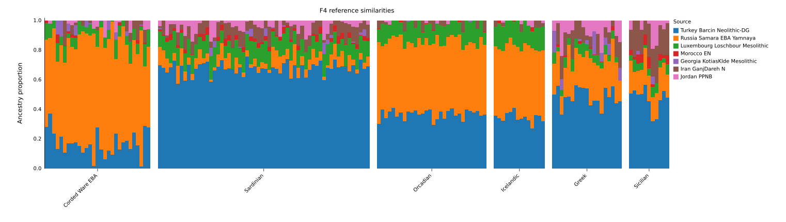

# F4Mix

> Fast, reliable sample-wise reference fitting with covariance-aware f4
> profiles.

F4Mix models genomes as mixtures of reference populations, fitting one target
sample at a time with covariance-aware f4 statistics.

The resulting weights estimate reference similarity.



## How it works

Each run is built from three statistical components:

- **Targets** are the samples to fit.
- **Sources** are the reference populations used as model components.
- **Right populations** define the f4 axes but are not fitted components.

F4Mix first pools each source population, then computes an f4 profile for every
target and fits non-negative weights that sum to one.

The feature builder does not choose a privileged Right base. For every source
and target it calculates all unordered pairwise contrasts
`f4(source, target; right_i, right_j)`. It then uses the full joint covariance
to project that redundant system into an orthonormal `number_of_rights - 1`
dimensional Helmert basis. Reordering the Right populations can rotate the
reported feature coordinates, but does not change their contrast space or
privilege one population in the fit.

All target, source, and pairwise-Right statistics are accumulated together by
a vectorized block kernel, while jackknife covariance is constructed separately
for each target to avoid a quadratic cross-target covariance matrix.

The legacy `outgroup` model argument remains accepted so existing run scripts
continue to work, but it is not loaded or used by the base-free feature builder.

Independent Right populations provide the contrast needed to distinguish
sources. Source individuals are not suitable Right populations; poorly chosen
or redundant Rights can make the fitted weights unstable or difficult to
interpret.

Uncertainty is estimated with a block jackknife using a default block size of
0.05 Morgans (5 cM). EIGENSTRAT genetic positions are read in Morgans;
PLINK BIM positions are converted from centimorgans to Morgans. These follow
the [EIGENSTRAT format](https://github.com/DReichLab/EIG/blob/master/CONVERTF/README)
and [PLINK BIM format](https://www.cog-genomics.org/plink/2.0/formats#bim).
Internally the legacy column name `cm` contains **Morgans**, including in
manually constructed `AfData` tables. A `blgsize` of 100 or more requests
base-pair blocks instead. Missing genetic maps retain the 2 Mb fallback.

Joint covariance uses aligned block influences, normalized separately by each
statistic's effective block count. Missing blocks contribute zero. The resulting
Gram matrix preserves marginal jackknife variances and is positive semidefinite;
cross-covariances are not divided by pairwise overlap counts. This remains an
asymptotic covariance estimate and assumes approximately independent blocks.

## Install

Start by creating and activating a virtual environment:

```bash
python -m venv venv
source venv/bin/activate
python -m pip install -r requirements.txt
```

If you already have an environment containing these requirements, you can
activate it instead.

Install F4Mix from this directory:

```bash
python -m pip install -e .
```

F4Mix requires Python 3.10 or newer.
Its dependencies are `numpy`, `pandas`, and `scipy`.

## Run a fit

Configure the genotype prefix, targets, sources, and right populations in
[`run_model.py`](run_model.py), then launch the recipe with:

```bash
python run_model.py
```

The input prefix should identify matching genotype, SNP, and individual files.
Population labels are read from the individual file.

A typical workflow looks like this:

```python
import f4mix as fm

data = (
    fm.open_genotypes(DATA_PREFIX)
    .select(populations=LOAD_POPULATIONS)
    .exclude(samples=EXCLUDE_SAMPLES)
)

result = fm.F4Model(
    sources=SOURCE_POPULATIONS,
    right=RIGHT_POPULATIONS,
).fit(data, target_populations=TARGET_POPULATIONS)

result.save(OUTPUT_DIRECTORY)
print(result.summary_frame())
```

Population selection only changes metadata until the fit reads the data;
sample exclusions are applied before genotype data are loaded.

To plot the saved weights, run:

```bash
python plot_weights.py
```

The script reads the tracked demo output and writes
`runs/modern/reference_similarity.svg`.

## Quality checks

New fits report a separate, conservative goodness-of-fit calculation in
`targets.tsv`:

- `fit_statistic`: minimum quadratic residual Q over the allowed mixture weights,
  including the weight-dependent source/target covariance.
- `fit_pvalue`: chi-square survival probability with `fit_dof` equal to the number
  of projected f4 features (normally the number of Rights minus one). No fitted
  weight degrees of freedom are subtracted.
- `pvalue_method`: `chi2_d_conservative_asymptotic`, or `unavailable`.
- `fit_status`: `rejected` for p < 0.05, `not rejected` otherwise, or `unavailable`
  when optimization or covariance checks prevent a result. `fit_test_message`
  explains availability and assumptions; `fit_alpha` records the threshold.
- `optimizer_success`: convergence of the ancestry weight estimator. The legacy
  `success` column remains an alias and is not a statistical acceptance flag.

The conservative argument is Q_min <= Q(true weights), which asymptotically has
a chi-square distribution with d contrast dimensions under a correct model and
valid covariance. Covariance regularization further changes the approximation.
The minimum is approximated with multistart SLSQP; global optimality is not
guaranteed. This is not an exact or simulation-calibrated p-value. Singular
contrast systems retain the nominal d, making the reference distribution more
conservative; zero covariance is unavailable. A large p-value means the model
was not rejected, not that its ancestry interpretation is established. Selecting
sources using these same data also affects interpretation.

Reported weights now minimize the same covariance-aware quadratic residual Q
used by the fit test, using multiple SLSQP starts. There is no covariance
log-determinant term: a variance preference must not create an apparently
informative split between identical, zero-residual source profiles.
`chi_square` and `fit_statistic` should agree up to numerical optimization error.
The test weights remain available in `fit_test_weights.tsv` and
`result.fit_test_weights_frame()` for compatibility; nonunique minima can have
different weights with the same Q. Differences in Q across source panels still
require calibration to test whether an individual source is needed.

`targets.tsv` includes `source_contrast_rank`, `free_weight_parameters`, and
`weights_identifiable`. A deficient rank means the mean contrasts cannot identify
all free proportions; the displayed weights are one solution and their standard
errors are unavailable. Full rank is only an algebraic diagnostic: it does not
establish that similar sources can be distinguished with useful precision.
The `weights_z.tsv` ratios are descriptive, not calibrated significance tests,
especially for weights at the nonnegative boundary.

Jackknife replicates now use the same weight estimator and objective as the full
fit, recomputing the weight-dependent residual covariance at each optimization
step. The estimated full-data joint covariance and feature projection remain
fixed because replicate-specific covariance estimates are not stored. This is
a conditional jackknife approximation. `jackknife_replicates` and
`jackknife_replicates_used` expose completeness; standard errors are unavailable
if any requested replicate is invalid or fails optimization. These changes can
increase run time. Existing saved runs must be rerun to obtain the new outputs.

`targets.tsv` reports two measures of coverage:

- `target_callable_snps` is the number of callable SNPs for the target.
- `min_effective_f4_snps` is the smallest usable SNP count across the raw
  source-target and pairwise-Right f4 statistics entering the projection.

The second measure is the one that matters for fitting, since it captures
missingness in both the target and comparison populations.

For reliable results, aim for at least 50,000 effective f4 SNPs. Treat lower
counts as a quality warning.

By default, F4Mix warns whenever the minimum effective count falls below
50,000. You can change that threshold as follows:

```python
model = fm.F4Model(
    sources=SOURCE_POPULATIONS,
    right=RIGHT_POPULATIONS,
    min_effective_f4_snps_warning=25_000,
)
```

Set the value to `None` to disable the warning. Warnings do not remove samples
automatically; explicit exclusions should be made with
`.exclude(samples=...)`.

Weight standard errors can be skipped to shorten a run. This does not skip the
block-jackknife covariance used for fitting and goodness-of-fit p-values:

```python
result = model.fit(
    data,
    target_populations=TARGET_POPULATIONS,
    jackknife=False,
)
```

With this option, `weights_se.tsv` and `weights_z.tsv` contain unavailable
values, while fit statistics and p-values are still produced. The choice is
recorded as `jackknife.enabled` in `run.json`.

## Output files

`result.save(...)` writes:

```text
weights.tsv       fitted weight for each source and target
weights_se.tsv    block-jackknife standard errors
weights_z.tsv     weight divided by its standard error
fit_test_weights.tsv  minimum-Q weights used for the goodness-of-fit calculation
targets.tsv       fit status, optimizer diagnostics, residuals, and SNP coverage
run.json          run settings, feature builder, f4 features, and sample counts
```

## Demo

The included [`run_model.py`](run_model.py) defines the current demonstration
run.

Generated example files are available in [`runs/modern/`](runs/modern/), and
the SVG plot provides a quick visual summary of the fitted reference
similarities.
