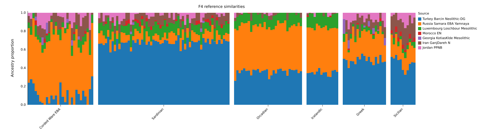

# F4Mix

> Fast, reliable sample-wise reference fitting with covariance-aware f4
> profiles.

F4Mix models genomes as mixtures of reference populations, fitting one target
sample at a time with covariance-aware f4 statistics.

The resulting weights estimate reference similarity.



## How it works

Each run is built from four components:

- **Targets** are the samples to fit.
- **Sources** are the reference populations used as model components.
- **Right populations** define the f4 axes but are not fitted components.
- **The outgroup** anchors each f4 statistic. The default is `Chimp`, since it
  does not overlap with human populations.

F4Mix first pools each source population, then computes an f4 profile for every
target and fits non-negative weights that sum to one.

Each source population needs suitable reference anchors, while independent right
populations provide the contrast needed to distinguish sources. Source
individuals are not suitable right-population anchors; poorly chosen anchors can
make the fitted weights unstable or difficult to interpret.

Uncertainty is estimated with a block jackknife using a default block size of
0.05 cM.

## Install

Start by creating and activating a virtual environment:

```bash
python -m venv venv
source venv/bin/activate
python -m pip install -r requirements.txt
```

If you already have an environment containing these requirements, you can
activate it instead.

Install F4Mix from this directory:

```bash
python -m pip install -e .
```

F4Mix requires Python 3.10 or newer.
Its dependencies are `numpy`, `pandas`, and `scipy`.

## Run a fit

Configure the genotype prefix, targets, sources, and right populations in
[`run_model.py`](run_model.py), then launch the recipe with:

```bash
python run_model.py
```

The input prefix should identify matching genotype, SNP, and individual files.
Population labels are read from the individual file.

A typical workflow looks like this:

```python
import f4mix as fm

data = (
    fm.open_genotypes(DATA_PREFIX)
    .select(populations=LOAD_POPULATIONS)
    .exclude(samples=EXCLUDE_SAMPLES)
)

result = fm.F4Model(
    sources=SOURCE_POPULATIONS,
    right=RIGHT_POPULATIONS,
).fit(data, target_populations=TARGET_POPULATIONS)

result.save(OUTPUT_DIRECTORY)
print(result.summary_frame())
```

Population selection only changes metadata until the fit reads the data;
sample exclusions are applied before genotype data are loaded.

To plot the saved weights, run:

```bash
python plot_weights.py
```

The script reads the example output and writes
`runs/example/reference_similarity.svg`.

## Quality checks

`targets.tsv` reports two measures of coverage:

- `target_callable_snps` is the number of callable SNPs for the target.
- `min_effective_f4_snps` is the smallest usable SNP count across the f4
  features.

The second measure is the one that matters for fitting, since it captures
missingness in both the target and comparison populations.

For reliable results, aim for at least 50,000 effective f4 SNPs. Treat lower
counts as a quality warning.

By default, F4Mix warns whenever the minimum effective count falls below
50,000. You can change that threshold as follows:

```python
model = fm.F4Model(
    sources=SOURCE_POPULATIONS,
    right=RIGHT_POPULATIONS,
    min_effective_f4_snps_warning=25_000,
)
```

Set the value to `None` to disable the warning. Warnings do not remove samples
automatically; explicit exclusions should be made with
`.exclude(samples=...)`.

## Output files

`result.save(...)` writes:

```text
weights.tsv       fitted weight for each source and target
weights_se.tsv    block-jackknife standard errors
weights_z.tsv     weight divided by its standard error
targets.tsv       fit status, optimizer diagnostics, residuals, and SNP coverage
run.json          run settings, f4 features, and sample counts
```

## Demo

The included [`run_model.py`](run_model.py) defines the current demonstration
run.

Generated example files are available in [`runs/example/`](runs/example/), and
the SVG plot provides a quick visual summary of the fitted reference
similarities.
